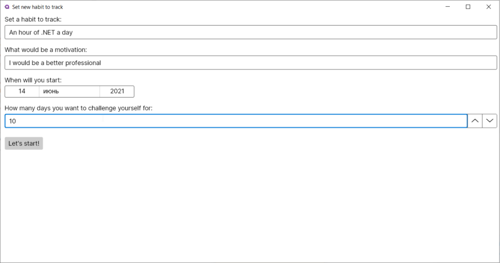
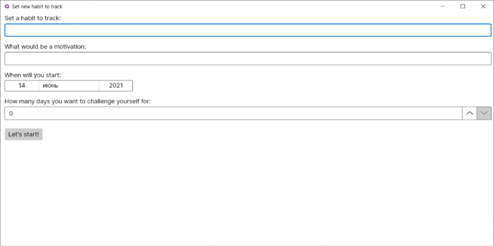
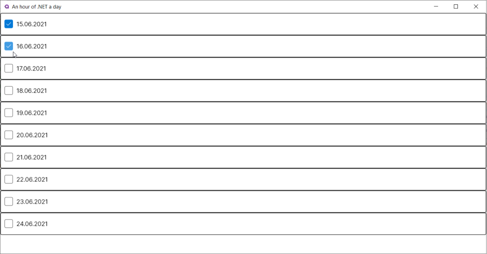
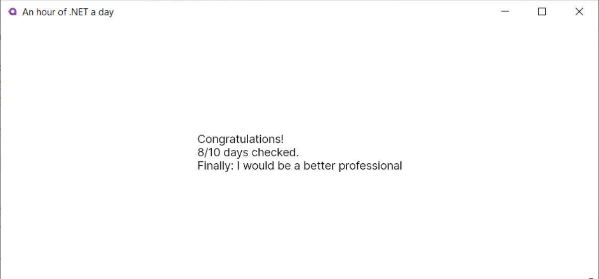

# Team 00 – .NET Boot camp
### Breaking the Habit

# Contents
1. [Chapter I](#chapter-i) \
	[General Rules](#general-rules)
2. [Chapter II](#chapter-ii) \
	[Rules of the Day](#rules-of-the-day)
3. [Chapter III](#chapter-iii) \
	[Intro](#intro)
4. [Chapter IV](#chapter-iv) \
	[Exercise 00 – Domain](#exercise-00-domain)
5. [Chapter V](#chapter-v) \
  [Exercise 01 – Interface](#exercise-01-interface) 
6. [Chapter VI](#chapter-vi) \
  [Exercise 02 – Data](#exercise-02-data) 
7. [Chapter VII](#chapter-vii) \
  [Bonus – You're breathtaking!](#bonus-youre-breathtaking)

# Chapter I 

## General Rules
- Make sure you have [the .NET 5 SDK](<https://dotnet.microsoft.com/download>) installed on your computer and use it.
- Remember, your code will be read! Pay special attention to the design of your code and the naming of variables. Adhere to commonly accepted [C# Coding Conventions](<https://docs.microsoft.com/en-us/dotnet/csharp/fundamentals/coding-style/coding-conventions>).
- Choose your own IDE that is convenient for you.
- The program must be able to run from the dotnet command line.
- Each of the exercise contains examples of input and output. The solution should use them as the correct format.
- At the beginning of each task, there is a list of allowed language constructs.
- If you find the problem difficult to solve, ask questions to other piscine participants, the Internet, Google or go to StackOverflow.
- You may see the main features of C# language in [official specification](<https://docs.microsoft.com/en-us/dotnet/csharp/language-reference/language-specification/introduction>).
- Avoid **hard coding** and **"magic numbers"**.
- You demonstrate the complete solution, the correct result of the program is just one of the ways to check its correct operation. Therefore, when it is necessary to obtain a certain output as a result of the work of your programs, it is forbidden to show a pre-calculated result.
- Pay special attention to the terms highlighted in **bold** font: their study will be useful to you both in performing the current task, and in your future career of a .NET developer.
- Have fun :)


# Chapter II
##  Rules of the Day

- All projects must be in the same solution.
- Use **var**.
- The name of the solution (and its separate catalog) is d_{xx}, where xx are the digits of the current day. Names of projects are in exercises.
- To format the output data, use the en-GB **culture**: N2 for the output of monetary amounts, d for dates.

## Recommended project structure:
```
rush00.App
	Assets/
		...
	Models/
		...
	ViewModels/
		...
	Views/
		...
	App.axaml
	Program.cs
	ViewLocator.cs
rush00.Data
	Migrations/
		...
	Models/
		Habit.cs
		HabitCheck.cs
	HabitDbContext.cs

```
# Chapter III
## Intro
Until 2003, professional cyclists in the UK were not taken seriously. Since 1908, they have won only one gold medal at the Olympic Games. And they have never won in the Tour de France race in 110 years.

Everything changed when the management hired coach Dave Brailsford. He did not just train the team, but changed the environment to improve the health and comfort of athletes. According to his instructions, the bicycle seats were replaced with more comfortable ones, alcohol was rubbed into the tires for better traction. The athletes were given clothes that maintain the desired temperature during the ride. Dave monitored the athletes' loads using sensors, picked up a massage gel for quick muscle recovery, and changed pillows and mattresses so that the athletes could better sleep.

This is only part of what he did. In general, his actions led to amazing results. After 5 years, cyclists from Great Britain won 60% of the gold medals at the Olympic Games in Beijing. And at the London Olympics, they set 9 Olympic and 7 world records.

«New York Times» journalist James Clear explores habits, writes about them in [his blog](<https://jamesclear.com/articles>) and [book «Atomic Habits»](<https://www.labirint.ru/books/727534/>). In his articles, he says that people tend to think better of themselves than they really are. This happens because that's how our brain works. 

As an example, he cites studies in which the first group of losing weight kept food diaries, and the second did not. So, people from the first group lost twice more weight than from the second, at the same time. This difference was explained by the fact that the first group saw the real picture and controlled themselves better. While people from the second group sometimes did not notice that they ate an extra sandwich or drank Cola instead of mineral water.

To visualize this picture, there are so-called habit trackers. How do they work? They help form:
1. Visual trigger. The tracker itself reminds you to complete the task.
2. Visibility of progress. When we see filled squares, we have an incentive not to quit what we started.
3. Reward. We are pleased to cross out another day, but in order to do it, we need to complete the task.

But you should not take up several habits at once. It is difficult for a person to get used to several changes at the same time, so resistance and a desire to quit everything appear much brighter.

# Chapter IV
## Exercise 00 – Domain

“If we regularly repeat an action, it forms neural connections in our brain. It can be considered as an algorithm or a ready-made program, which later allows us to perform this task much easier, faster and even mechanically.”

**― Psychology of Habit**

Today, we will create our own habit tracker. In the intro, you can glean a lot of useful information, and it will help us to make the first and one of the most important steps in the development of any project - the development of a domain model.
What will our tracker do? We need to have an opportunity to describe the habit and track its progress (or rejection) every day for a given period of time. In fact, put ticks every day.
So, we need a _Habit_ object that describes the habit: its title (_Title_) and motivation for maintaining tracking (_Motivation_). For a habit, you will need to keep track of progress: it can be set by a collection of _HabitCheck_ objects for each of the planned tracking days, which will be determined by the _Date_ and _IsChecked_ properties. As soon as all the days have passed (whether they were ticked or not) tracking is completed and that can be ticked in the _IsFinished_ property.

Now we have a simple model.

Let's agree, we can track one habit any time. This simplification will help us both in developing and tracking this habit. So, if there is no unfinished tracking in the system, we should be able to create it by filling in the habits title, motivation, start date and the number of tracking days. 

If a habit is tracked, we should be able to tick its compliance or rejection on each of the days (set _IsChecked_ for a specific _HabitCheck_ object). The tick can be set for any date.

If the last date is ticked or the last tracking day has passed, the _IsFinished_ property of the _Habit_ object should become true. 

Let's move on to the implementation.

# Chapter V
## Exercise 01 – Interface

Let's implement a simple interface for our tracker: let it be a **desktop application**. For .NET desktop applications development, **WPF** and **UWP**, which are among the most common platforms, have gained immense popularity. Unfortunately, they are very limited as they allow you to develop only on Windows. 

We will look towards the [Avalonia UI](<https://docs.avaloniaui.net/>). It is a new, but actively developing cross-platform **UI framework**, which the developers call the spiritual successor of WPF technology. It is based on **XAML** markup and allows to create desktop applications for different operating systems. The most commonly used design pattern for development is **MVVM**.

We just need a few simple screens.

### Setting a habit
If there is no active tracking habit in the system, the application should display the setting screen. 



The user fills in the required fields to start tracking.



Pay attention to the input data: all fields are required; the number of days should not be negative. The «start» button should lead to the next screen.

### Tracking
If there is a tracking habit set for tracking (or it was filled in a previous step), the user should see the tracking screen. Here they have the opportunity to tick each of the days.



It is important to process each tick (the **Checked event** of each **CheckBox** object) in order to set and save it in the model. Don't forget to check if the tracking is complete! 

The above screenshots of the program will help you understand what exactly needs to be implemented.

Be sure to use the official [AvaloniaUI documentation](<https://docs.avaloniaui.net/>) - you will find a description of all the necessary components there, [the basics](<https://docs.avaloniaui.net/guides/basics>) of technology and [tutorials](<https://docs.avaloniaui.net/tutorials/todo-list-app>) of two simple projects that will help you understand and master the basic principles of development. In addition, read about [DataContext](<https://rachel53461.wordpress.com/2012/07/14/what-is-this-datacontext-you-speak-of/>). 

# Chapter VI
## Exercise 02 – Data

All you have left to do is make sure the data isn’t saved only in memory while the application is running. Let each launch of the application work with an up-to-date and saved dataset. For this we will need a **database** - let's take the simplest option and store everything in one file using **SQLite**.

The days of directly accessing databases and writing SQL queries directly from the application are over. Development is becoming more abstract and high-level, and various **ORMs** are most often used to access data. This technology allows you to communicate with databases in the context of OOP objects, rather than data tables and SQL queries, in fact, allowing you to project data from the database directly into application objects (and vice versa).

.NET applications use the **Entity Framework** and the most common approach is **Code First**. What does it mean?

It means having a description of our domain model in the form of the _Habit_ and _HabitCheck_ classes in the application, we can configure it so that the database and the corresponding tables are created themselves based on our code. And with any change in the code in them, the **database schema** will be updated using the migration mechanism built into the Entity Framework.

Next, we can view the data from the database as a collection of corresponding objects and access them using LINQ queries.

Let's start by splitting the code into two projects: _rush00.App_ and _rush00.Data_. The first one will contain all the display logic of our application, the second one will contain the domain models. To test yourself, ask yourself: what will happen if I decide to use a different way of input and output of information, and instead of a desktop application, it is a web application or a console application?

With this separation, you can easily reuse a project that implements the main logic, and simply connect another application to it with a new entry point.

Install the **Microsoft.EntityFrameworkCore.Tools** and **Microsoft.EntityFrameworkCore.Sqlite** packages using the **nuget manager**.

To work with data, create the _HabitDbContext_ class and inherit it from Microsoft.EntityFrameworkCore.DbContext. It will be the [main service](<https://www.entityframeworktutorial.net/efcore/entity-framework-core-dbcontext.aspx>) for working with objects from the database. There will be two of our collections in _HabitDbContext_:
```
DbSet<Habit> Habits
DbSet<HabitCheck> HabitChecks
```

To use the SQLite database data access context, add to _HabitDbContext_:
```
protected override void OnConfiguring(DbContextOptionsBuilder optionsBuilder)
{
	optionsBuilder.UseSqlite("Filename=habits.db");
}
```

Now [set up migrations](<https://docs.microsoft.com/en-us/ef/core/managing-schemas/migrations/?tabs=dotnet-core-cli>), for this you just use the command:
```
dotnet ef migrations add {MigrationName}
```

A folder with migrations should appear in your project, check what code was generated and what tables will be created with it. Don't forget to add _Id_ fields to the _Habit_ and _HabitCheck_ objects!

Next, the created migrations need to be “applied” to our database using the command:
```
dotnet ef database update
```

Or add code to App.axaml.cs that will check and roll migrations of our context, when the application is launched:
```
using (var context = new HabitDbContext())
{
	context.Database.EnsureCreated();
}
```

Pay attention to the **using** construction.

Now when the database exists, we just need to use an instance of the _HabitDbContext_ class and access the collections of its _Habit_ and _HabitCheck_ objects using LINQ methods.

For example, getting up-to-date tracking of a habit will look like this:
```
using (var context = new HabitDbContext())
{
	var habit = _dbContext.Habits
                	.Include(x => x.HabitChecks)
                	.FirstOrDefault(x => !x.IsFinished);
}
```

Pay attention to the [Include method](<https://docs.microsoft.com/en-us/ef/ef6/querying/related-data>), it allows you to load related data by a foreign key.

If you save to the database using the Add method or edit the fields of database objects, do not forget to save the changes [using the SaveChanges()](<https://docs.microsoft.com/en-us/dotnet/api/microsoft.entityframeworkcore.dbcontext.savechanges?view=efcore-5.0>) method.

Connect DB to your code so that:
-  When launching the application, it is checked whether there is a habit with current tracking in the database.
- If there is none, the habit can be created in DB, a collection of HabitChecks are created for all DB tracking dates.
- If one exists (or was just created), a screen with dates and ticks is displayed for up-to-date information from DB.
- The tick for the date in the tracking is recorded in DB.
- The completion tick is recorded in DB.


# Chapter VII
## Bonus – You're breathtaking!

As a bonus task, make it so that at the end of the tracking of the habit (_IsFinished_ == true), a congratulatory message is displayed with the number of completed days and a text of motivation.



### Self-test
- At the first launch, the application offers to fill in the information to create a habit tracker. 
- When you restart the app, it displays a list of dates for the created habit.
- For a created habit with ticked days, restarting displays the same ones.
